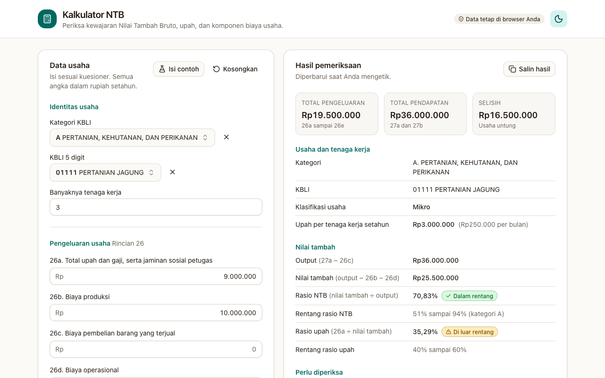

# Kalkulator NTB

Kalkulator NTB memeriksa apakah Nilai Tambah Bruto, upah, dan komponen biaya sebuah usaha masuk akal untuk kategori KBLI-nya. Aplikasi ini memindahkan berkas Excel *Kalkulator NTB_SharedV1.1* dari BPS Provinsi Sulawesi Tengah ke situs web, sehingga petugas cukup membuka tautan tanpa menyalin berkas.

Alamat situs: https://sukmanrml.github.io/kalkulator-ntb/



Perhitungan berjalan di peramban Anda. Angka yang diisi tidak dikirim ke server mana pun dan tidak disimpan setelah Anda menutup halaman.

## Cara memakai

1. Pilih kategori KBLI dan KBLI 5 digit. Kedua daftar bisa dicari dengan kode atau kata, misalnya `47111` atau `jagung`. Memilih KBLI mengisi kategorinya.
2. Isi banyaknya tenaga kerja, pengeluaran (rincian 26a sampai 26e), dan pendapatan (27a dan 27b). Semua angka dalam rupiah setahun. Untuk usaha yang mulai beroperasi tahun 2026, nyalakan saklar "Usaha mulai beroperasi tahun 2026" lalu isi rincian 31a dan semua rincian 26 dengan nilai sebulan. Aplikasi mengalikannya dengan 12.
3. Untuk kategori A, pilih komoditasnya (tanaman semusim, tanaman tahunan, atau ternak besar dan kecil). Pilihan ini dipakai untuk menghitung work in progress.
4. Baca hasilnya di panel kanan. Hasil berubah setiap kali Anda mengetik. Tombol "Salin hasil" menyalin ringkasannya sebagai teks, misalnya untuk ditempel ke catatan pemeriksaan.

Tombol "Isi contoh" mengisi contoh dari berkas Excel, dan "Kosongkan" menghapus semua isian.

## Contoh hitungan

Contoh bawaan: kategori A (pertanian), KBLI 01111 pertanian jagung, 3 tenaga kerja, upah Rp9.000.000, biaya produksi Rp10.000.000, biaya operasional Rp500.000, dan pendapatan Rp36.000.000.

| Hasil | Nilai | Keterangan |
|---|---|---|
| Upah per tenaga kerja | Rp3.000.000 setahun | Di bawah batas Rp12.000.000. Muncul peringatan agar upah dan jumlah tenaga kerja diperiksa kembali, karena setara Rp250.000 per bulan. |
| Nilai tambah | Rp25.500.000 | Omzet Rp36.000.000 dikurangi biaya produksi dan operasional. Biaya pembelian (26c) bernilai nol pada contoh ini. |
| Rasio NTB | 70,83% | Masih dalam rentang kategori A, yaitu 51,34% sampai 93,92%. |
| Rasio upah | 35,29% | Di luar rentang 40% sampai 60%. Saran upah: Rp3.422.100 sampai Rp10.266.300. |

## Istilah

Definisi mengikuti petunjuk di FASIH Pendataan SE 2026 (Badan Pusat Statistik).

- **Omzet** adalah nilai produksi, penjualan, atau pendapatan barang dan jasa. Untuk usaha yang beroperasi sebelum 2026, nilainya rincian 27a. Untuk usaha yang mulai beroperasi tahun 2026, nilainya rincian 31a dikali 12, dan rincian 26a sampai 26e juga diisi per bulan lalu dikali 12.
- **Output** adalah omzet dikurangi biaya pembelian barang yang terjual (26c).
- **Nilai tambah** adalah omzet dikurangi biaya produksi (26b), biaya pembelian barang yang terjual (26c), dan biaya operasional (26d). Biaya pembelian dikurangkan satu kali, lewat output. Hasilnya sama dengan rumus berkas Excel.

## Saran nilai inputan

Kartu ini berasal dari Kalkulator NTB Sumatera Utara V.1.1. Ia menjawab dua pertanyaan: berapa pendapatan yang membuat rasio NTB masuk rentang kategori untuk biaya yang sudah diisi, dan berapa biaya produksi dan operasional yang sesuai untuk pendapatan yang sudah diisi.

| Baris | Rumus |
|---|---|
| Nilai pendapatan (27a) | 26c + (26b + 26d) ÷ (1 − rasio), dengan rasio batas bawah dan batas atas kategori |
| Work in progress (kategori A) | Persentase komoditas dikali nilai pendapatan: tanaman semusim 5%, tanaman tahunan 3%, ternak besar dan kecil 25% |
| Total pendapatan (input FASIH) | Nilai pendapatan + work in progress |
| Total biaya produksi + operasional | Output × (1 − rasio), dengan batas atas rasio memberi biaya terendah |

Contoh dari berkas Sumatera Utara: kategori A, tanaman semusim, biaya produksi Rp1.000.000, tanpa biaya lain. Saran nilai pendapatan Rp2.055.242 sampai Rp16.460.126, work in progress Rp102.762 sampai Rp823.006, dan total input FASIH Rp2.158.004 sampai Rp17.283.132. Angka ini diuji otomatis.

Baris "rekomendasi" menulis "Tidak ada, sudah sesuai batas" jika rasio NTB dalam rentang. Jika di luar rentang, ia meminta Anda memeriksa kembali digitasi nilai pengeluaran dan pendapatan serta kesesuaiannya dengan data lapangan.

## Aturan pemeriksaan

| Perhitungan | Rumus dan batas |
|---|---|
| Upah per tenaga kerja setahun | 26a dibagi tenaga kerja. Wajar antara Rp12.000.000 dan Rp144.000.000. |
| Total pengeluaran | 26a + 26b + 26c + 26d + 26e. Jika melebihi total pendapatan (omzet + 27b), komponen terbesar ditandai. |
| Output | Omzet - 26c |
| Nilai tambah | Output - 26b - 26d, sama dengan omzet - 26b - 26c - 26d. |
| Rasio NTB | Nilai tambah dibagi output, dibandingkan dengan rentang kategori. |
| Rasio upah | 26a dibagi nilai tambah. Wajar antara 40% dan 60%. |
| Saran upah | Nilai tambah dikali persentase upah kategori, dari batas bawah sampai batas atas. |
| Saran biaya | Muncul jika rasio NTB di luar rentang. Rasio di atas 85% berarti biaya terlalu kecil, dan aplikasi menyarankan rentang biaya sebagai bagian dari output. Pada rasio 85% atau lebih rendah, biaya disarankan turun. |
| Klasifikasi usaha | Mikro 1 sampai 4 tenaga kerja, kecil 5 sampai 19, menengah/besar 20 atau lebih. |

Rentang rasio NTB memakai ketelitian penuh dari lembar Threshold di berkas Sumatera Utara. Berkas Sulawesi Tengah membulatkannya ke dua desimal. Dari 22 kategori KBLI (A sampai V), 20 punya rentang rasio NTB. Kategori P tidak punya rentang dan selalu ditandai di luar rentang, sama seperti di Excel. Kategori V tidak punya batas sama sekali, jadi aplikasi hanya menampilkan catatan.

## Perbedaan dengan berkas Excel

Perilaku yang berbeda dari berkas Excel:

- Usaha dengan 20 tenaga kerja atau lebih diklasifikasikan menengah/besar. Di Excel hasilnya "Tidak Valid" karena sel batas maksimumnya kosong.
- Saran untuk biaya pembelian saat rasio NTB di luar rentang dan tidak melebihi 85% berbunyi "Turunkan Biaya Pembelian Barang dan Jasa". Di Excel tertulis "Turunkan Biaya Operasional", salah salin dari baris di bawahnya.
- Aplikasi menyediakan saklar untuk usaha yang mulai beroperasi tahun 2026, dengan omzet dari rincian 31a dan pengeluaran rincian 26 yang diisi per bulan, semuanya dikali 12. Berkas Excel hanya punya rincian 27a. Arti 31a diambil dari definisi omzet di FASIH.
- Pada saran nilai pendapatan, berkas Sumatera Utara hanya membagi biaya produksi dengan (1 − rasio) lalu menambahkan biaya operasional. Hasilnya hanya tepat di batas rasio jika biaya operasional nol. Aplikasi ini membagi biaya produksi dan biaya operasional bersama, dan hasilnya sama dengan berkas itu pada contoh di atas.
- Pada saran biaya untuk kategori G, berkas Sumatera Utara memasukkan biaya pembelian ke total biaya. Aplikasi ini menghitung biaya produksi dan operasional dari output, jadi pembelian tidak ikut.
- Rumus nilai tambah berkas Sumatera Utara (pendapatan dikurangi biaya produksi dan operasional) tidak mengurangi biaya pembelian (26c). Aplikasi ini memakai definisi FASIH: pendapatan dikurangi 26b, 26c, dan 26d.
- Untuk kategori G, berkas Sumatera Utara memakai batas 0,28 sampai 0,81 (basis DBDisjas). Aplikasi ini memakai batas 0,64 sampai 0,78 yang sama dengan berkas Sulawesi Tengah.
- Saran upah tidak muncul jika nilai tambah nol atau negatif. Sebagai gantinya muncul peringatan nilai tambah negatif.

## Data

`src/data/ntb-data.json` berisi 22 kategori KBLI, 1.559 kode KBLI lima digit, rentang rasio NTB, persentase upah per kategori, dan batas umum. Berkas ini dibuat dari berkas Excel dengan skrip yang hanya membaca master KBLI dan lembar batas wajar:

```bash
python3 tools/extract-data.py "/jalur/ke/Kalkulator NTB_SharedV1.1.xlsx" "/jalur/ke/Kalkulator NTB Sumatera Utara_V.1.1.xlsx"
```

Berkas kedua bersifat opsional dan menyediakan rentang rasio NTB dengan ketelitian penuh. Skrip tidak membaca isian responden. Persentase work in progress ada di `src/data/sumut-extra.json`.

## Pengembangan

Aplikasi memakai Vue 3, TypeScript, Vite, Tailwind CSS 4, dan [shadcn-vue](https://www.shadcn-vue.com) dengan gaya `new-york`, warna dasar `stone`, dan warna utama teal. Tema terang atau gelap mengikuti pengaturan sistem dan bisa diganti lewat tombol di pojok kanan atas.

```bash
pnpm install
pnpm dev        # server pengembangan
pnpm test       # 11 tes perhitungan (vitest)
pnpm build      # hasil di dist/
```

Rumus ada di `src/lib/ntb.ts` dan tidak bergantung pada Vue, sehingga bisa diuji tanpa antarmuka. Penyusunan teks peringatan ada di `src/lib/summary.ts`, dan `src/composables/useNtbCalculator.ts` menghubungkan keduanya ke komponen.

## Menerbitkan ke GitHub Pages

Situs terbit dari cabang `gh-pages`. Cabang itu tidak memerlukan GitHub Actions.

```bash
pnpm deploy
```

Skrip membangun situs, lalu mendorong isi `dist/` ke cabang `gh-pages` di remote `origin`. Di pengaturan repositori, sumber Pages adalah cabang `gh-pages` dengan folder root.

## Batasan

Batas kewajaran berasal dari berkas sumber dan dipakai untuk pemeriksaan awal. Petugas tetap memutuskan apakah angka sebuah usaha perlu dikonfirmasi ulang ke responden.

## Sumber

- Rumus, batas kewajaran, dan master KBLI berasal dari berkas Excel *Kalkulator NTB_SharedV1.1* buatan BPS Provinsi Sulawesi Tengah. Penyusun berkas: Apriliansyah Mahmud, S.Tr.Stat.
- Rentang rasio NTB dengan ketelitian penuh, kartu saran nilai inputan, dan persentase work in progress berasal dari berkas Excel *Kalkulator NTB Sumatera Utara_V.1.1* buatan BPS Provinsi Sumatera Utara.
- Definisi omzet, output, dan nilai tambah, termasuk rincian 31a untuk usaha baru, berasal dari petunjuk FASIH Pendataan SE 2026 milik Badan Pusat Statistik.
- Aplikasi web ini alat bantu pemeriksaan dan bukan terbitan resmi BPS.

## Lisensi

Kode memakai lisensi MIT. Lihat berkas `LICENSE`. Lisensi itu tidak mencakup rumus, batas kewajaran, dan master KBLI di atas, yang tetap bersumber dari BPS.
